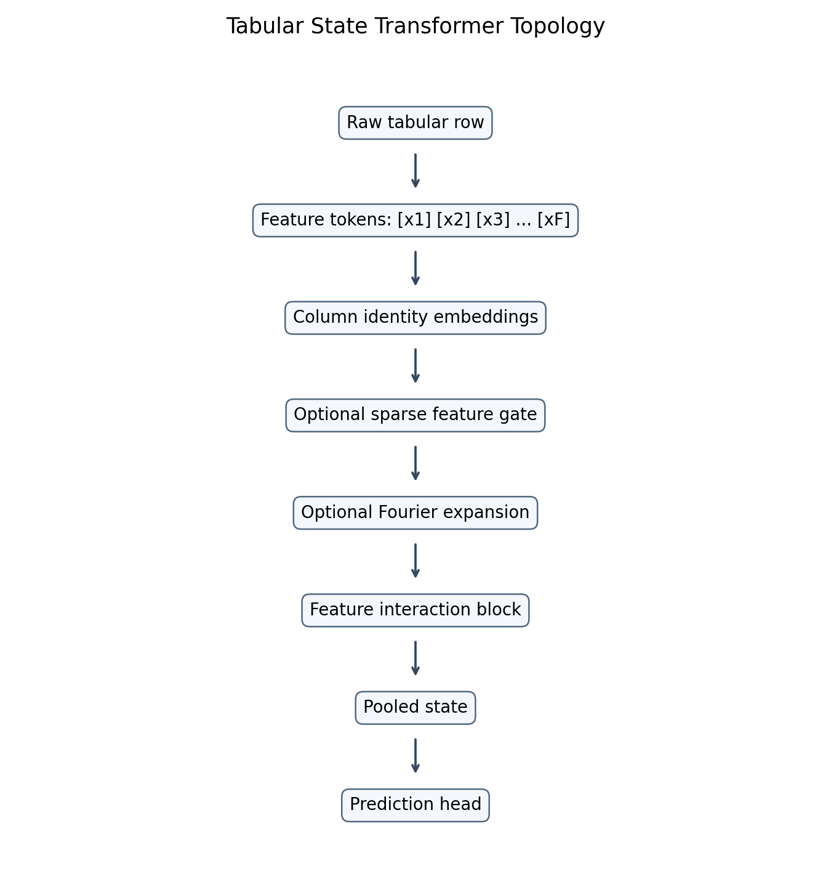
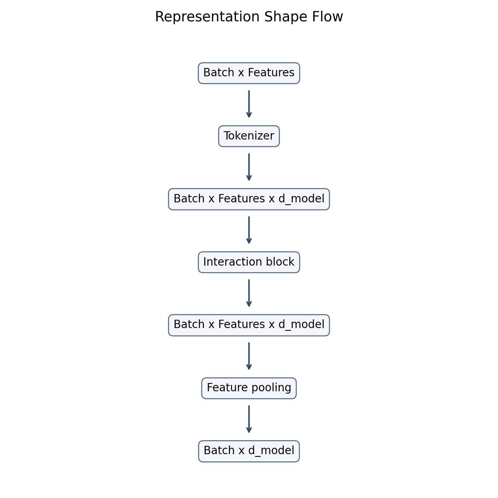
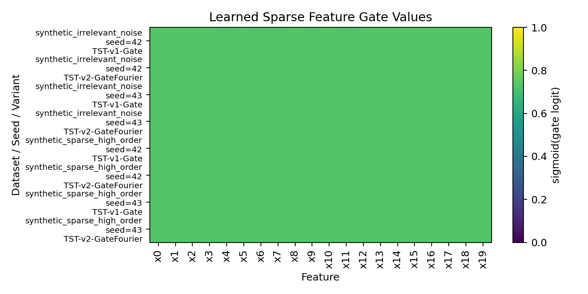
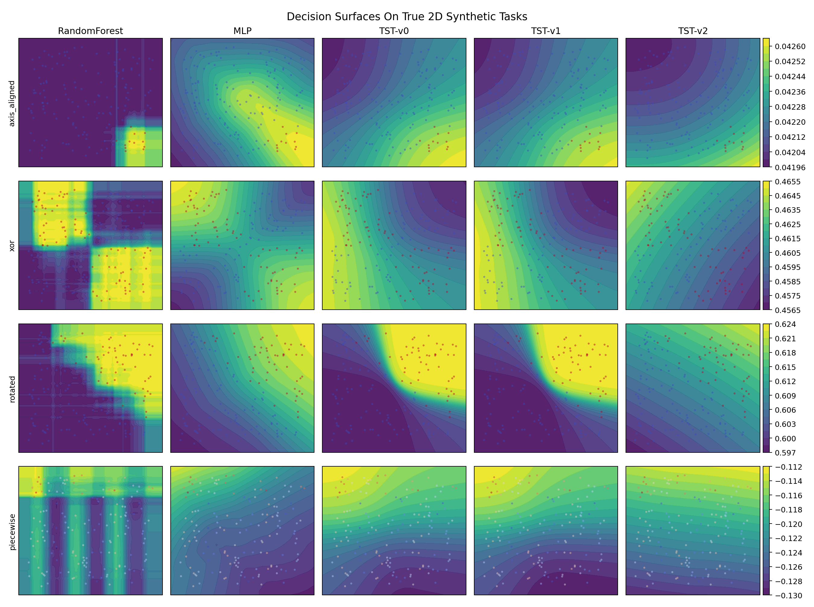

| Model | Dataset | Seed | Task | Family | Variant | Status | Metric | Score | Fit Seconds | Predict Seconds | N Samples | N Features | Artifact Path | Error Message | Notes |
| --- | --- | --- | --- | --- | --- | --- | --- | --- | --- | --- | --- | --- | --- | --- | --- |
| Linear/Ridge | synthetic_axis_aligned | 42 | classification | baseline | linear | ok | accuracy | 0.941463 | 0.0091 | 0.001 | 1024 | 20 |  |  |  |
| Random Forest | synthetic_axis_aligned | 42 | classification | baseline | random_forest | ok | accuracy | 0.990244 | 0.0403 | 0.0025 | 1024 | 20 |  |  |  |
| MLP | synthetic_axis_aligned | 42 | classification | baseline | mlp | ok | accuracy | 0.931707 | 0.0515 | 0.0013 | 1024 | 20 |  |  |  |
| LightGBM | synthetic_axis_aligned | 42 | classification | baseline | lightgbm | ok | accuracy | 1.0 | 0.1687 | 0.0059 | 1024 | 20 |  |  |  |
| CatBoost | synthetic_axis_aligned | 42 | classification | baseline | catboost | ok | accuracy | 1.0 | 2.1081 | 0.0026 | 1024 | 20 |  |  |  |
| TST-v0 | synthetic_axis_aligned | 42 | classification | ablation | TST-v0 | ok | accuracy | 0.912195 | 8.1636 | 0.0253 | 1024 | 20 |  |  |  |
| TST-v1-Gate | synthetic_axis_aligned | 42 | classification | ablation | TST-v1-Gate | ok | accuracy | 0.912195 | 7.5908 | 0.0215 | 1024 | 20 |  |  |  |
| TST-v2-GateFourier | synthetic_axis_aligned | 42 | classification | ablation | TST-v2-GateFourier | ok | accuracy | 0.912195 | 7.5165 | 0.0187 | 1024 | 20 |  |  |  |
| TST-v3-MoE | synthetic_axis_aligned | 42 | classification | ablation | TST-v3-MoE | ok | accuracy | 0.912195 | 7.6803 | 0.0253 | 1024 | 20 |  |  |  |
| Linear/Ridge | synthetic_xor | 42 | classification | baseline | linear | ok | accuracy | 0.429268 | 0.0051 | 0.0012 | 1024 | 20 |  |  |  |
| Random Forest | synthetic_xor | 42 | classification | baseline | random_forest | ok | accuracy | 0.595122 | 0.063 | 0.003 | 1024 | 20 |  |  |  |
| MLP | synthetic_xor | 42 | classification | baseline | mlp | ok | accuracy | 0.765854 | 0.0569 | 0.0015 | 1024 | 20 |  |  |  |
| LightGBM | synthetic_xor | 42 | classification | baseline | lightgbm | ok | accuracy | 0.985366 | 0.0468 | 0.003 | 1024 | 20 |  |  |  |
| CatBoost | synthetic_xor | 42 | classification | baseline | catboost | ok | accuracy | 0.985366 | 1.0659 | 0.0018 | 1024 | 20 |  |  |  |
| TST-v0 | synthetic_xor | 42 | classification | ablation | TST-v0 | ok | accuracy | 0.512195 | 7.7544 | 0.0205 | 1024 | 20 |  |  |  |
| TST-v1-Gate | synthetic_xor | 42 | classification | ablation | TST-v1-Gate | ok | accuracy | 0.512195 | 7.2698 | 0.0172 | 1024 | 20 |  |  |  |
| TST-v2-GateFourier | synthetic_xor | 42 | classification | ablation | TST-v2-GateFourier | ok | accuracy | 0.512195 | 7.7661 | 0.0182 | 1024 | 20 |  |  |  |
| TST-v3-MoE | synthetic_xor | 42 | classification | ablation | TST-v3-MoE | ok | accuracy | 0.512195 | 8.4422 | 0.0189 | 1024 | 20 |  |  |  |
| Linear/Ridge | synthetic_piecewise | 42 | regression | baseline | linear | ok | rmse | 0.786671 | 0.0048 | 0.0012 | 1024 | 20 |  |  |  |
| Random Forest | synthetic_piecewise | 42 | regression | baseline | random_forest | ok | rmse | 0.276584 | 0.1538 | 0.0033 | 1024 | 20 |  |  |  |
| MLP | synthetic_piecewise | 42 | regression | baseline | mlp | ok | rmse | 0.798763 | 0.0492 | 0.0012 | 1024 | 20 |  |  |  |
| LightGBM | synthetic_piecewise | 42 | regression | baseline | lightgbm | ok | rmse | 0.215951 | 0.045 | 0.0039 | 1024 | 20 |  |  |  |
| CatBoost | synthetic_piecewise | 42 | regression | baseline | catboost | ok | rmse | 0.178699 | 0.7806 | 0.0023 | 1024 | 20 |  |  |  |
| TST-v0 | synthetic_piecewise | 42 | regression | ablation | TST-v0 | ok | rmse | 0.844707 | 7.3576 | 0.0237 | 1024 | 20 |  |  |  |
| TST-v1-Gate | synthetic_piecewise | 42 | regression | ablation | TST-v1-Gate | ok | rmse | 0.844653 | 7.7749 | 0.0193 | 1024 | 20 |  |  |  |
| TST-v2-GateFourier | synthetic_piecewise | 42 | regression | ablation | TST-v2-GateFourier | ok | rmse | 0.846124 | 8.242 | 0.0222 | 1024 | 20 |  |  |  |
| TST-v3-MoE | synthetic_piecewise | 42 | regression | ablation | TST-v3-MoE | ok | rmse | 0.842159 | 8.1058 | 0.0218 | 1024 | 20 |  |  |  |
| Linear/Ridge | synthetic_irrelevant_noise | 42 | classification | baseline | linear | ok | accuracy | 0.804878 | 0.0063 | 0.0013 | 1024 | 100 |  |  |  |
| Random Forest | synthetic_irrelevant_noise | 42 | classification | baseline | random_forest | ok | accuracy | 0.843902 | 0.0938 | 0.0031 | 1024 | 100 |  |  |  |
| MLP | synthetic_irrelevant_noise | 42 | classification | baseline | mlp | ok | accuracy | 0.795122 | 0.0646 | 0.0017 | 1024 | 100 |  |  |  |
| LightGBM | synthetic_irrelevant_noise | 42 | classification | baseline | lightgbm | ok | accuracy | 0.917073 | 0.2296 | 0.0045 | 1024 | 100 |  |  |  |
| CatBoost | synthetic_irrelevant_noise | 42 | classification | baseline | catboost | ok | accuracy | 0.921951 | 4.2121 | 0.0176 | 1024 | 100 |  |  |  |
| TST-v0 | synthetic_irrelevant_noise | 42 | classification | ablation | TST-v0 | ok | accuracy | 0.502439 | 44.2182 | 0.1892 | 1024 | 100 |  |  |  |
| TST-v1-Gate | synthetic_irrelevant_noise | 42 | classification | ablation | TST-v1-Gate | ok | accuracy | 0.502439 | 41.3493 | 0.0976 | 1024 | 100 |  |  |  |
| TST-v2-GateFourier | synthetic_irrelevant_noise | 42 | classification | ablation | TST-v2-GateFourier | ok | accuracy | 0.502439 | 47.1633 | 0.1585 | 1024 | 100 |  |  |  |
| TST-v3-MoE | synthetic_irrelevant_noise | 42 | classification | ablation | TST-v3-MoE | ok | accuracy | 0.497561 | 49.6953 | 0.1143 | 1024 | 100 |  |  |  |
| Linear/Ridge | synthetic_rotated | 42 | classification | baseline | linear | ok | accuracy | 0.970732 | 0.0053 | 0.0009 | 1024 | 20 |  |  |  |
| Random Forest | synthetic_rotated | 42 | classification | baseline | random_forest | ok | accuracy | 0.931707 | 0.0503 | 0.0029 | 1024 | 20 |  |  |  |
| MLP | synthetic_rotated | 42 | classification | baseline | mlp | ok | accuracy | 0.926829 | 0.0539 | 0.0015 | 1024 | 20 |  |  |  |
| LightGBM | synthetic_rotated | 42 | classification | baseline | lightgbm | ok | accuracy | 0.95122 | 0.0546 | 0.0029 | 1024 | 20 |  |  |  |
| CatBoost | synthetic_rotated | 42 | classification | baseline | catboost | ok | accuracy | 0.956098 | 1.357 | 0.0021 | 1024 | 20 |  |  |  |
| TST-v0 | synthetic_rotated | 42 | classification | ablation | TST-v0 | ok | accuracy | 0.62439 | 7.4447 | 0.0198 | 1024 | 20 |  |  |  |
| TST-v1-Gate | synthetic_rotated | 42 | classification | ablation | TST-v1-Gate | ok | accuracy | 0.62439 | 8.5628 | 0.0184 | 1024 | 20 |  |  |  |
| TST-v2-GateFourier | synthetic_rotated | 42 | classification | ablation | TST-v2-GateFourier | ok | accuracy | 0.62439 | 8.1417 | 0.0193 | 1024 | 20 |  |  |  |
| TST-v3-MoE | synthetic_rotated | 42 | classification | ablation | TST-v3-MoE | ok | accuracy | 0.887805 | 7.704 | 0.0186 | 1024 | 20 |  |  |  |
| Linear/Ridge | synthetic_regime | 42 | regression | baseline | linear | ok | rmse | 0.519227 | 0.0047 | 0.0008 | 1024 | 20 |  |  |  |
| Random Forest | synthetic_regime | 42 | regression | baseline | random_forest | ok | rmse | 0.303688 | 0.1439 | 0.0031 | 1024 | 20 |  |  |  |
| MLP | synthetic_regime | 42 | regression | baseline | mlp | ok | rmse | 0.412808 | 0.0491 | 0.0012 | 1024 | 20 |  |  |  |
| LightGBM | synthetic_regime | 42 | regression | baseline | lightgbm | ok | rmse | 0.286742 | 0.0435 | 0.003 | 1024 | 20 |  |  |  |
| CatBoost | synthetic_regime | 42 | regression | baseline | catboost | ok | rmse | 0.209871 | 0.8895 | 0.0021 | 1024 | 20 |  |  |  |
| TST-v0 | synthetic_regime | 42 | regression | ablation | TST-v0 | ok | rmse | 0.648568 | 7.6343 | 0.0177 | 1024 | 20 |  |  |  |
| TST-v1-Gate | synthetic_regime | 42 | regression | ablation | TST-v1-Gate | ok | rmse | 0.64863 | 7.609 | 0.0181 | 1024 | 20 |  |  |  |
| TST-v2-GateFourier | synthetic_regime | 42 | regression | ablation | TST-v2-GateFourier | ok | rmse | 0.649164 | 7.7175 | 0.0188 | 1024 | 20 |  |  |  |
| TST-v3-MoE | synthetic_regime | 42 | regression | ablation | TST-v3-MoE | ok | rmse | 0.565224 | 7.6651 | 0.0203 | 1024 | 20 |  |  |  |
| Linear/Ridge | synthetic_sparse_high_order | 42 | classification | baseline | linear | ok | accuracy | 0.970732 | 0.0055 | 0.0009 | 1024 | 50 |  |  |  |
| Random Forest | synthetic_sparse_high_order | 42 | classification | baseline | random_forest | ok | accuracy | 0.965854 | 0.0543 | 0.0028 | 1024 | 50 |  |  |  |
| MLP | synthetic_sparse_high_order | 42 | classification | baseline | mlp | ok | accuracy | 0.960976 | 0.0552 | 0.0014 | 1024 | 50 |  |  |  |
| LightGBM | synthetic_sparse_high_order | 42 | classification | baseline | lightgbm | ok | accuracy | 1.0 | 0.0707 | 0.0023 | 1024 | 50 |  |  |  |
| CatBoost | synthetic_sparse_high_order | 42 | classification | baseline | catboost | ok | accuracy | 0.990244 | 1.8424 | 0.0019 | 1024 | 50 |  |  |  |
| TST-v0 | synthetic_sparse_high_order | 42 | classification | ablation | TST-v0 | ok | accuracy | 0.965854 | 20.4579 | 0.0475 | 1024 | 50 |  |  |  |
| TST-v1-Gate | synthetic_sparse_high_order | 42 | classification | ablation | TST-v1-Gate | ok | accuracy | 0.965854 | 18.5969 | 0.043 | 1024 | 50 |  |  |  |
| TST-v2-GateFourier | synthetic_sparse_high_order | 42 | classification | ablation | TST-v2-GateFourier | ok | accuracy | 0.965854 | 21.5954 | 0.2598 | 1024 | 50 |  |  |  |
| TST-v3-MoE | synthetic_sparse_high_order | 42 | classification | ablation | TST-v3-MoE | ok | accuracy | 0.965854 | 36.0203 | 0.0823 | 1024 | 50 |  |  |  |
| Linear/Ridge | synthetic_axis_aligned | 43 | classification | baseline | linear | ok | accuracy | 0.946341 | 0.02 | 0.0022 | 1024 | 20 |  |  |  |
| Random Forest | synthetic_axis_aligned | 43 | classification | baseline | random_forest | ok | accuracy | 0.995122 | 0.0444 | 0.0033 | 1024 | 20 |  |  |  |
| MLP | synthetic_axis_aligned | 43 | classification | baseline | mlp | ok | accuracy | 0.931707 | 0.0944 | 0.0048 | 1024 | 20 |  |  |  |
| LightGBM | synthetic_axis_aligned | 43 | classification | baseline | lightgbm | ok | accuracy | 0.990244 | 0.0327 | 0.0032 | 1024 | 20 |  |  |  |
| CatBoost | synthetic_axis_aligned | 43 | classification | baseline | catboost | ok | accuracy | 0.990244 | 2.8404 | 0.0096 | 1024 | 20 |  |  |  |
| TST-v0 | synthetic_axis_aligned | 43 | classification | ablation | TST-v0 | ok | accuracy | 0.902439 | 7.7542 | 0.0201 | 1024 | 20 |  |  |  |
| TST-v1-Gate | synthetic_axis_aligned | 43 | classification | ablation | TST-v1-Gate | ok | accuracy | 0.902439 | 7.3701 | 0.0176 | 1024 | 20 |  |  |  |
| TST-v2-GateFourier | synthetic_axis_aligned | 43 | classification | ablation | TST-v2-GateFourier | ok | accuracy | 0.902439 | 8.41 | 0.0191 | 1024 | 20 |  |  |  |
| TST-v3-MoE | synthetic_axis_aligned | 43 | classification | ablation | TST-v3-MoE | ok | accuracy | 0.907317 | 8.7168 | 0.0205 | 1024 | 20 |  |  |  |
| Linear/Ridge | synthetic_xor | 43 | classification | baseline | linear | ok | accuracy | 0.463415 | 0.0063 | 0.0011 | 1024 | 20 |  |  |  |
| Random Forest | synthetic_xor | 43 | classification | baseline | random_forest | ok | accuracy | 0.707317 | 0.0539 | 0.0033 | 1024 | 20 |  |  |  |
| MLP | synthetic_xor | 43 | classification | baseline | mlp | ok | accuracy | 0.8 | 0.0525 | 0.0014 | 1024 | 20 |  |  |  |
| LightGBM | synthetic_xor | 43 | classification | baseline | lightgbm | ok | accuracy | 1.0 | 0.0452 | 0.003 | 1024 | 20 |  |  |  |
| CatBoost | synthetic_xor | 43 | classification | baseline | catboost | ok | accuracy | 1.0 | 0.9859 | 0.0023 | 1024 | 20 |  |  |  |
| TST-v0 | synthetic_xor | 43 | classification | ablation | TST-v0 | ok | accuracy | 0.526829 | 9.1284 | 0.0224 | 1024 | 20 |  |  |  |
| TST-v1-Gate | synthetic_xor | 43 | classification | ablation | TST-v1-Gate | ok | accuracy | 0.526829 | 19.764 | 0.0407 | 1024 | 20 |  |  |  |
| TST-v2-GateFourier | synthetic_xor | 43 | classification | ablation | TST-v2-GateFourier | ok | accuracy | 0.526829 | 12.8016 | 0.0283 | 1024 | 20 |  |  |  |
| TST-v3-MoE | synthetic_xor | 43 | classification | ablation | TST-v3-MoE | ok | accuracy | 0.526829 | 11.4081 | 0.0374 | 1024 | 20 |  |  |  |
| Linear/Ridge | synthetic_piecewise | 43 | regression | baseline | linear | ok | rmse | 0.737068 | 0.0191 | 0.0024 | 1024 | 20 |  |  |  |
| Random Forest | synthetic_piecewise | 43 | regression | baseline | random_forest | ok | rmse | 0.223516 | 0.4214 | 0.0364 | 1024 | 20 |  |  |  |
| MLP | synthetic_piecewise | 43 | regression | baseline | mlp | ok | rmse | 0.783063 | 0.1107 | 0.0447 | 1024 | 20 |  |  |  |
| LightGBM | synthetic_piecewise | 43 | regression | baseline | lightgbm | ok | rmse | 0.213925 | 0.3555 | 0.0094 | 1024 | 20 |  |  |  |
| CatBoost | synthetic_piecewise | 43 | regression | baseline | catboost | ok | rmse | 0.154311 | 2.2693 | 0.0441 | 1024 | 20 |  |  |  |
| TST-v0 | synthetic_piecewise | 43 | regression | ablation | TST-v0 | ok | rmse | 0.807722 | 16.4813 | 0.0234 | 1024 | 20 |  |  |  |
| TST-v1-Gate | synthetic_piecewise | 43 | regression | ablation | TST-v1-Gate | ok | rmse | 0.80788 | 9.404 | 0.0344 | 1024 | 20 |  |  |  |
| TST-v2-GateFourier | synthetic_piecewise | 43 | regression | ablation | TST-v2-GateFourier | ok | rmse | 0.814321 | 11.003 | 0.0276 | 1024 | 20 |  |  |  |
| TST-v3-MoE | synthetic_piecewise | 43 | regression | ablation | TST-v3-MoE | ok | rmse | 0.812575 | 10.6525 | 0.0389 | 1024 | 20 |  |  |  |
| Linear/Ridge | synthetic_irrelevant_noise | 43 | classification | baseline | linear | ok | accuracy | 0.804878 | 0.0246 | 0.0037 | 1024 | 100 |  |  |  |
| Random Forest | synthetic_irrelevant_noise | 43 | classification | baseline | random_forest | ok | accuracy | 0.843902 | 0.1808 | 0.0065 | 1024 | 100 |  |  |  |
| MLP | synthetic_irrelevant_noise | 43 | classification | baseline | mlp | ok | accuracy | 0.765854 | 0.1265 | 0.0053 | 1024 | 100 |  |  |  |
| LightGBM | synthetic_irrelevant_noise | 43 | classification | baseline | lightgbm | ok | accuracy | 0.941463 | 0.4283 | 0.0054 | 1024 | 100 |  |  |  |
| CatBoost | synthetic_irrelevant_noise | 43 | classification | baseline | catboost | ok | accuracy | 0.936585 | 8.2841 | 0.0447 | 1024 | 100 |  |  |  |
| TST-v0 | synthetic_irrelevant_noise | 43 | classification | ablation | TST-v0 | ok | accuracy | 0.512195 | 72.0312 | 0.2067 | 1024 | 100 |  |  |  |
| TST-v1-Gate | synthetic_irrelevant_noise | 43 | classification | ablation | TST-v1-Gate | ok | accuracy | 0.512195 | 57.1695 | 0.1318 | 1024 | 100 |  |  |  |
| TST-v2-GateFourier | synthetic_irrelevant_noise | 43 | classification | ablation | TST-v2-GateFourier | ok | accuracy | 0.512195 | 60.5777 | 0.2881 | 1024 | 100 |  |  |  |
| TST-v3-MoE | synthetic_irrelevant_noise | 43 | classification | ablation | TST-v3-MoE | ok | accuracy | 0.512195 | 44.9771 | 0.1027 | 1024 | 100 |  |  |  |
| Linear/Ridge | synthetic_rotated | 43 | classification | baseline | linear | ok | accuracy | 0.980488 | 0.0226 | 0.0012 | 1024 | 20 |  |  |  |
| Random Forest | synthetic_rotated | 43 | classification | baseline | random_forest | ok | accuracy | 0.95122 | 0.0484 | 0.0032 | 1024 | 20 |  |  |  |
| MLP | synthetic_rotated | 43 | classification | baseline | mlp | ok | accuracy | 0.970732 | 0.0545 | 0.0013 | 1024 | 20 |  |  |  |
| LightGBM | synthetic_rotated | 43 | classification | baseline | lightgbm | ok | accuracy | 0.970732 | 0.0536 | 0.0031 | 1024 | 20 |  |  |  |
| CatBoost | synthetic_rotated | 43 | classification | baseline | catboost | ok | accuracy | 0.97561 | 1.3195 | 0.0032 | 1024 | 20 |  |  |  |
| TST-v0 | synthetic_rotated | 43 | classification | ablation | TST-v0 | ok | accuracy | 0.790244 | 10.2663 | 0.0964 | 1024 | 20 |  |  |  |
| TST-v1-Gate | synthetic_rotated | 43 | classification | ablation | TST-v1-Gate | ok | accuracy | 0.634146 | 8.3874 | 0.0171 | 1024 | 20 |  |  |  |
| TST-v2-GateFourier | synthetic_rotated | 43 | classification | ablation | TST-v2-GateFourier | ok | accuracy | 0.634146 | 7.4052 | 0.0243 | 1024 | 20 |  |  |  |
| TST-v3-MoE | synthetic_rotated | 43 | classification | ablation | TST-v3-MoE | ok | accuracy | 0.634146 | 7.3113 | 0.0212 | 1024 | 20 |  |  |  |
| Linear/Ridge | synthetic_regime | 43 | regression | baseline | linear | ok | rmse | 0.461956 | 0.0127 | 0.0009 | 1024 | 20 |  |  |  |
| Random Forest | synthetic_regime | 43 | regression | baseline | random_forest | ok | rmse | 0.248116 | 0.141 | 0.0037 | 1024 | 20 |  |  |  |
| MLP | synthetic_regime | 43 | regression | baseline | mlp | ok | rmse | 0.358535 | 0.0499 | 0.0013 | 1024 | 20 |  |  |  |
| LightGBM | synthetic_regime | 43 | regression | baseline | lightgbm | ok | rmse | 0.237267 | 0.0434 | 0.003 | 1024 | 20 |  |  |  |
| CatBoost | synthetic_regime | 43 | regression | baseline | catboost | ok | rmse | 0.194142 | 0.7929 | 0.0018 | 1024 | 20 |  |  |  |
| TST-v0 | synthetic_regime | 43 | regression | ablation | TST-v0 | ok | rmse | 0.579152 | 7.4992 | 0.0176 | 1024 | 20 |  |  |  |
| TST-v1-Gate | synthetic_regime | 43 | regression | ablation | TST-v1-Gate | ok | rmse | 0.584828 | 7.5635 | 0.0215 | 1024 | 20 |  |  |  |
| TST-v2-GateFourier | synthetic_regime | 43 | regression | ablation | TST-v2-GateFourier | ok | rmse | 0.600911 | 7.3064 | 0.0206 | 1024 | 20 |  |  |  |
| TST-v3-MoE | synthetic_regime | 43 | regression | ablation | TST-v3-MoE | ok | rmse | 0.582777 | 8.2944 | 0.0202 | 1024 | 20 |  |  |  |
| Linear/Ridge | synthetic_sparse_high_order | 43 | classification | baseline | linear | ok | accuracy | 0.970732 | 0.0073 | 0.001 | 1024 | 50 |  |  |  |
| Random Forest | synthetic_sparse_high_order | 43 | classification | baseline | random_forest | ok | accuracy | 0.97561 | 0.0544 | 0.0026 | 1024 | 50 |  |  |  |
| MLP | synthetic_sparse_high_order | 43 | classification | baseline | mlp | ok | accuracy | 0.97561 | 0.0579 | 0.0015 | 1024 | 50 |  |  |  |
| LightGBM | synthetic_sparse_high_order | 43 | classification | baseline | lightgbm | ok | accuracy | 0.990244 | 0.0772 | 0.0025 | 1024 | 50 |  |  |  |
| CatBoost | synthetic_sparse_high_order | 43 | classification | baseline | catboost | ok | accuracy | 0.990244 | 1.7941 | 0.0026 | 1024 | 50 |  |  |  |
| TST-v0 | synthetic_sparse_high_order | 43 | classification | ablation | TST-v0 | ok | accuracy | 0.97561 | 20.8653 | 0.0407 | 1024 | 50 |  |  |  |
| TST-v1-Gate | synthetic_sparse_high_order | 43 | classification | ablation | TST-v1-Gate | ok | accuracy | 0.97561 | 19.7146 | 0.0407 | 1024 | 50 |  |  |  |
| TST-v2-GateFourier | synthetic_sparse_high_order | 43 | classification | ablation | TST-v2-GateFourier | ok | accuracy | 0.97561 | 20.3442 | 0.0435 | 1024 | 50 |  |  |  |
| TST-v3-MoE | synthetic_sparse_high_order | 43 | classification | ablation | TST-v3-MoE | ok | accuracy | 0.97561 | 20.4636 | 0.0504 | 1024 | 50 |  |  |  |
| Linear/Ridge | synthetic_axis_aligned | 44 | classification | baseline | linear | ok | accuracy | 0.970732 | 0.0052 | 0.0014 | 1024 | 20 |  |  |  |
| Random Forest | synthetic_axis_aligned | 44 | classification | baseline | random_forest | ok | accuracy | 0.995122 | 0.0386 | 0.0033 | 1024 | 20 |  |  |  |
| MLP | synthetic_axis_aligned | 44 | classification | baseline | mlp | ok | accuracy | 0.941463 | 0.0515 | 0.0013 | 1024 | 20 |  |  |  |
| LightGBM | synthetic_axis_aligned | 44 | classification | baseline | lightgbm | ok | accuracy | 0.995122 | 0.0448 | 0.0028 | 1024 | 20 |  |  |  |
| CatBoost | synthetic_axis_aligned | 44 | classification | baseline | catboost | ok | accuracy | 1.0 | 1.2675 | 0.0026 | 1024 | 20 |  |  |  |
| TST-v0 | synthetic_axis_aligned | 44 | classification | ablation | TST-v0 | ok | accuracy | 0.892683 | 7.477 | 0.0195 | 1024 | 20 |  |  |  |
| TST-v1-Gate | synthetic_axis_aligned | 44 | classification | ablation | TST-v1-Gate | ok | accuracy | 0.892683 | 7.1203 | 0.0191 | 1024 | 20 |  |  |  |
| TST-v2-GateFourier | synthetic_axis_aligned | 44 | classification | ablation | TST-v2-GateFourier | ok | accuracy | 0.892683 | 7.4183 | 0.0209 | 1024 | 20 |  |  |  |
| TST-v3-MoE | synthetic_axis_aligned | 44 | classification | ablation | TST-v3-MoE | ok | accuracy | 0.892683 | 8.3021 | 0.0253 | 1024 | 20 |  |  |  |
| Linear/Ridge | synthetic_xor | 44 | classification | baseline | linear | ok | accuracy | 0.463415 | 0.0055 | 0.0103 | 1024 | 20 |  |  |  |
| Random Forest | synthetic_xor | 44 | classification | baseline | random_forest | ok | accuracy | 0.712195 | 0.0747 | 0.0036 | 1024 | 20 |  |  |  |
| MLP | synthetic_xor | 44 | classification | baseline | mlp | ok | accuracy | 0.756098 | 0.0595 | 0.0017 | 1024 | 20 |  |  |  |
| LightGBM | synthetic_xor | 44 | classification | baseline | lightgbm | ok | accuracy | 0.995122 | 0.0486 | 0.0031 | 1024 | 20 |  |  |  |
| CatBoost | synthetic_xor | 44 | classification | baseline | catboost | ok | accuracy | 0.995122 | 1.1843 | 0.0027 | 1024 | 20 |  |  |  |
| TST-v0 | synthetic_xor | 44 | classification | ablation | TST-v0 | ok | accuracy | 0.526829 | 9.1263 | 0.0246 | 1024 | 20 |  |  |  |
| TST-v1-Gate | synthetic_xor | 44 | classification | ablation | TST-v1-Gate | ok | accuracy | 0.526829 | 8.3942 | 0.0182 | 1024 | 20 |  |  |  |
| TST-v2-GateFourier | synthetic_xor | 44 | classification | ablation | TST-v2-GateFourier | ok | accuracy | 0.526829 | 7.7712 | 0.0188 | 1024 | 20 |  |  |  |
| TST-v3-MoE | synthetic_xor | 44 | classification | ablation | TST-v3-MoE | ok | accuracy | 0.526829 | 7.6005 | 0.0222 | 1024 | 20 |  |  |  |
| Linear/Ridge | synthetic_piecewise | 44 | regression | baseline | linear | ok | rmse | 0.765868 | 0.0041 | 0.0013 | 1024 | 20 |  |  |  |
| Random Forest | synthetic_piecewise | 44 | regression | baseline | random_forest | ok | rmse | 0.277101 | 0.1589 | 0.0031 | 1024 | 20 |  |  |  |
| MLP | synthetic_piecewise | 44 | regression | baseline | mlp | ok | rmse | 0.750108 | 0.0512 | 0.0012 | 1024 | 20 |  |  |  |
| LightGBM | synthetic_piecewise | 44 | regression | baseline | lightgbm | ok | rmse | 0.221305 | 0.0469 | 0.0032 | 1024 | 20 |  |  |  |
| CatBoost | synthetic_piecewise | 44 | regression | baseline | catboost | ok | rmse | 0.182939 | 0.8378 | 0.0019 | 1024 | 20 |  |  |  |
| TST-v0 | synthetic_piecewise | 44 | regression | ablation | TST-v0 | ok | rmse | 0.830456 | 7.4103 | 0.0178 | 1024 | 20 |  |  |  |
| TST-v1-Gate | synthetic_piecewise | 44 | regression | ablation | TST-v1-Gate | ok | rmse | 0.830547 | 7.2627 | 0.0173 | 1024 | 20 |  |  |  |
| TST-v2-GateFourier | synthetic_piecewise | 44 | regression | ablation | TST-v2-GateFourier | ok | rmse | 0.82808 | 7.4221 | 0.0184 | 1024 | 20 |  |  |  |
| TST-v3-MoE | synthetic_piecewise | 44 | regression | ablation | TST-v3-MoE | ok | rmse | 0.826454 | 8.3199 | 0.0223 | 1024 | 20 |  |  |  |
| Linear/Ridge | synthetic_irrelevant_noise | 44 | classification | baseline | linear | ok | accuracy | 0.863415 | 0.0066 | 0.0013 | 1024 | 100 |  |  |  |
| Random Forest | synthetic_irrelevant_noise | 44 | classification | baseline | random_forest | ok | accuracy | 0.839024 | 0.0982 | 0.003 | 1024 | 100 |  |  |  |
| MLP | synthetic_irrelevant_noise | 44 | classification | baseline | mlp | ok | accuracy | 0.858537 | 0.0629 | 0.0015 | 1024 | 100 |  |  |  |
| LightGBM | synthetic_irrelevant_noise | 44 | classification | baseline | lightgbm | ok | accuracy | 0.941463 | 0.2171 | 0.0049 | 1024 | 100 |  |  |  |
| CatBoost | synthetic_irrelevant_noise | 44 | classification | baseline | catboost | ok | accuracy | 0.936585 | 3.6353 | 0.0025 | 1024 | 100 |  |  |  |
| TST-v0 | synthetic_irrelevant_noise | 44 | classification | ablation | TST-v0 | ok | accuracy | 0.517073 | 44.6443 | 0.0884 | 1024 | 100 |  |  |  |
| TST-v1-Gate | synthetic_irrelevant_noise | 44 | classification | ablation | TST-v1-Gate | ok | accuracy | 0.517073 | 41.2439 | 0.1032 | 1024 | 100 |  |  |  |
| TST-v2-GateFourier | synthetic_irrelevant_noise | 44 | classification | ablation | TST-v2-GateFourier | ok | accuracy | 0.517073 | 45.7199 | 0.118 | 1024 | 100 |  |  |  |
| TST-v3-MoE | synthetic_irrelevant_noise | 44 | classification | ablation | TST-v3-MoE | ok | accuracy | 0.517073 | 45.7679 | 0.1388 | 1024 | 100 |  |  |  |
| Linear/Ridge | synthetic_rotated | 44 | classification | baseline | linear | ok | accuracy | 0.960976 | 0.0176 | 0.002 | 1024 | 20 |  |  |  |
| Random Forest | synthetic_rotated | 44 | classification | baseline | random_forest | ok | accuracy | 0.941463 | 0.0572 | 0.004 | 1024 | 20 |  |  |  |
| MLP | synthetic_rotated | 44 | classification | baseline | mlp | ok | accuracy | 0.941463 | 0.0588 | 0.0017 | 1024 | 20 |  |  |  |
| LightGBM | synthetic_rotated | 44 | classification | baseline | lightgbm | ok | accuracy | 0.956098 | 0.0619 | 0.0034 | 1024 | 20 |  |  |  |
| CatBoost | synthetic_rotated | 44 | classification | baseline | catboost | ok | accuracy | 0.965854 | 1.2484 | 0.0031 | 1024 | 20 |  |  |  |
| TST-v0 | synthetic_rotated | 44 | classification | ablation | TST-v0 | ok | accuracy | 0.614634 | 7.4 | 0.017 | 1024 | 20 |  |  |  |
| TST-v1-Gate | synthetic_rotated | 44 | classification | ablation | TST-v1-Gate | ok | accuracy | 0.614634 | 7.1769 | 0.0183 | 1024 | 20 |  |  |  |
| TST-v2-GateFourier | synthetic_rotated | 44 | classification | ablation | TST-v2-GateFourier | ok | accuracy | 0.614634 | 7.3792 | 0.0207 | 1024 | 20 |  |  |  |
| TST-v3-MoE | synthetic_rotated | 44 | classification | ablation | TST-v3-MoE | ok | accuracy | 0.95122 | 7.3008 | 0.0197 | 1024 | 20 |  |  |  |
| Linear/Ridge | synthetic_regime | 44 | regression | baseline | linear | ok | rmse | 0.478799 | 0.0036 | 0.0008 | 1024 | 20 |  |  |  |
| Random Forest | synthetic_regime | 44 | regression | baseline | random_forest | ok | rmse | 0.268013 | 0.1397 | 0.0031 | 1024 | 20 |  |  |  |
| MLP | synthetic_regime | 44 | regression | baseline | mlp | ok | rmse | 0.38228 | 0.0502 | 0.0013 | 1024 | 20 |  |  |  |
| LightGBM | synthetic_regime | 44 | regression | baseline | lightgbm | ok | rmse | 0.248173 | 0.0413 | 0.0035 | 1024 | 20 |  |  |  |
| CatBoost | synthetic_regime | 44 | regression | baseline | catboost | ok | rmse | 0.18249 | 0.7808 | 0.0017 | 1024 | 20 |  |  |  |
| TST-v0 | synthetic_regime | 44 | regression | ablation | TST-v0 | ok | rmse | 0.610325 | 7.101 | 0.0189 | 1024 | 20 |  |  |  |
| TST-v1-Gate | synthetic_regime | 44 | regression | ablation | TST-v1-Gate | ok | rmse | 0.610703 | 7.194 | 0.0212 | 1024 | 20 |  |  |  |
| TST-v2-GateFourier | synthetic_regime | 44 | regression | ablation | TST-v2-GateFourier | ok | rmse | 0.605215 | 8.5604 | 0.0196 | 1024 | 20 |  |  |  |
| TST-v3-MoE | synthetic_regime | 44 | regression | ablation | TST-v3-MoE | ok | rmse | 0.60612 | 7.6416 | 0.0209 | 1024 | 20 |  |  |  |
| Linear/Ridge | synthetic_sparse_high_order | 44 | classification | baseline | linear | ok | accuracy | 0.980488 | 0.0048 | 0.0009 | 1024 | 50 |  |  |  |
| Random Forest | synthetic_sparse_high_order | 44 | classification | baseline | random_forest | ok | accuracy | 0.980488 | 0.0535 | 0.0025 | 1024 | 50 |  |  |  |
| MLP | synthetic_sparse_high_order | 44 | classification | baseline | mlp | ok | accuracy | 0.980488 | 0.0534 | 0.0012 | 1024 | 50 |  |  |  |
| LightGBM | synthetic_sparse_high_order | 44 | classification | baseline | lightgbm | ok | accuracy | 0.995122 | 0.0743 | 0.0025 | 1024 | 50 |  |  |  |
| CatBoost | synthetic_sparse_high_order | 44 | classification | baseline | catboost | ok | accuracy | 0.980488 | 1.8575 | 0.002 | 1024 | 50 |  |  |  |
| TST-v0 | synthetic_sparse_high_order | 44 | classification | ablation | TST-v0 | ok | accuracy | 0.980488 | 18.4572 | 0.0447 | 1024 | 50 |  |  |  |
| TST-v1-Gate | synthetic_sparse_high_order | 44 | classification | ablation | TST-v1-Gate | ok | accuracy | 0.980488 | 21.1118 | 0.0435 | 1024 | 50 |  |  |  |
| TST-v2-GateFourier | synthetic_sparse_high_order | 44 | classification | ablation | TST-v2-GateFourier | ok | accuracy | 0.980488 | 20.2472 | 0.047 | 1024 | 50 |  |  |  |
| TST-v3-MoE | synthetic_sparse_high_order | 44 | classification | ablation | TST-v3-MoE | ok | accuracy | 0.980488 | 19.8282 | 0.0489 | 1024 | 50 |  |  |  |

<!-- topology-figures:start -->

## Tensor Topology Figures

- 
- 
- 
- 

<!-- topology-figures:end -->
